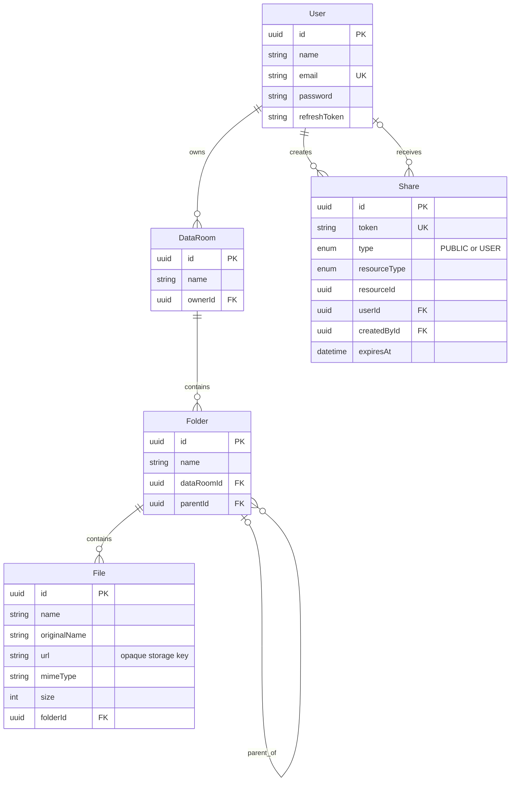

# Data Room

A full-stack virtual data room for organizing due-diligence documents and
sharing them through public links or read-only user permissions.

## Hosted application

- Frontend: https://data-room-web.onrender.com
- API: https://data-room-api-lij6.onrender.com

## Features

- Email/password authentication with rotating, hashed refresh tokens
- One owner-scoped Data Room created during registration
- Nested folders with breadcrumbs, rename, cycle protection, and cascade delete
- Drag-and-drop multi-file uploads with per-file progress, retry, and rename
- File preview, download, rename, move, and delete
- Public and existing-user shares for a Data Room, folder, or file
- Read-only inherited access to nested shared content
- Share expiration and owner revocation
- Local or private Supabase Storage selected through environment configuration
- Current-folder name search, type filtering, and sorting

Files intentionally live inside folders rather than directly at the Data Room
root. This keeps one ownership path (`File -> Folder -> DataRoom -> User`) for
authorization and uniqueness. The UI creates folders at the root, then permits
uploads inside them.

## Technology

- Frontend: React 19, TypeScript, Vite, Tailwind CSS
- Backend: NestJS, TypeScript, Prisma
- Database: PostgreSQL
- Blob storage: local filesystem for development or private Supabase Storage
- Authentication: JWT access and refresh tokens

## Architecture decisions

The API is the only layer allowed to access file bytes. Database rows contain
opaque storage keys, never public object URLs. `StorageService` selects a local
or Supabase implementation at startup, so authorization and file metadata logic
remain independent of the storage provider.

Ownership is derived from database relationships and never accepted from the
client. Read access is resolved from ownership, a direct file share, an ancestor
folder share, or a Data Room share. Mutation endpoints remain owner-only.
Unauthorized resource reads intentionally return `404` to avoid confirming that
a private resource exists.

Shares use a resource type and resource ID so the same permission model applies
to Data Rooms, folders, and files. Folder/file deletion removes direct shares for
the deleted subtree in the same database transaction. Blob cleanup happens after
the database transaction because PostgreSQL and object storage cannot share a
transaction; a production system would retry failed cleanup through a durable
job queue.

Text and active document formats such as HTML, XML, JSON, JavaScript, and SVG
are previewed as plain text. Safe raster images, audio, video, and PDF retain
their browser-native content type. All preview and download routes authorize
access before loading the private object.

## Data model



Folder names and file names are unique within their parent. Foreign keys cascade
ownership hierarchy deletion. `Share.resourceId` is intentionally polymorphic;
the service validates the referenced resource and explicitly removes affected
shares during resource deletion.

## Local setup

Prerequisites: Node.js 20+, npm, and Docker.

```bash
cp .env.example .env
npm install
docker compose up -d
cd apps/api
npx prisma migrate deploy
cd ../..
```

Start the API and frontend in separate terminals:

```bash
npm run start:dev --workspace api
```

```bash
npm run dev --workspace web
```

Open `http://localhost:5173`. The Vite development server proxies `/api` to
`http://localhost:3000`.

## Environment variables

The root `.env.example` contains all backend variables. Replace every
`change-me` secret before using a shared environment.

For local storage:

```env
STORAGE_DRIVER=local
LOCAL_STORAGE_PATH=./uploads
```

The directory must be persistent and writable by the API process. Existing
records whose keys start with `uploads/` remain readable by the local backend.

For Supabase Storage, create a **private** bucket and configure:

```env
STORAGE_DRIVER=supabase
SUPABASE_URL=https://your-project.supabase.co
SUPABASE_SECRET_KEY=sb_secret_...
SUPABASE_STORAGE_BUCKET=data-room-files
```

Use a server-side Supabase secret key. Never add it to frontend variables or
give it a `VITE_` prefix. Changing `STORAGE_DRIVER` does not migrate existing
objects; preserve database object keys when moving files between providers.

To test Supabase locally, update the storage variables, restart the API, upload
a file, preview and download it, then confirm the object exists in the private
bucket and cannot be opened through an unauthenticated bucket URL.

For a deployed frontend, set:

```env
VITE_API_URL=https://your-api.example.com
```

Set the API `CORS_ORIGIN` to the exact deployed frontend origin.

## Tests and checks

```bash
npm test --workspace api -- --runInBand
npm run test:e2e --workspace api -- --runInBand
npm run build --workspace api
npm run lint --workspace web
npm run build --workspace web
```

The e2e tests bind a temporary local HTTP port.

## How it scales

### Total folder size and item count

The MVP computes deletion impact by discovering the owned folder subtree and
aggregating file count and size. For larger trees, PostgreSQL should calculate
the subtree with a recursive CTE and aggregate files in the same query.

For frequently displayed totals, add `subtreeFileCount`, `subtreeFolderCount`,
and `subtreeSize` counters to folders. Upload, move, and delete operations would
update the affected ancestor chains transactionally. A periodic reconciliation
job would repair counters if an asynchronous storage operation failed.

### A Data Room with 100,000 files

The current MVP returns complete immediate-folder listings and is not intended
to render 100,000 rows at once. The next step is cursor pagination ordered by a
stable tuple such as `(name, id)`, returning separate folder and file cursors.
The existing `folderId`, `parentId`, and `dataRoomId` indexes support ownership
and hierarchy lookups; production listing/search would add composite indexes
such as `(folderId, name, id)` and `(dataRoomId, parentId, name, id)`.

Data Room-wide search should be server-side, paginated, and backed by a
case-insensitive filename index or PostgreSQL trigram/full-text search. The UI
would virtualize large result lists. Folder move/delete should use recursive SQL
or a materialized path/closure table instead of loading the full hierarchy into
application memory. Blob transfer should use signed URLs or streaming rather
than buffering large objects in the API.

### Extending sharing to viewer/editor roles

Add a `role` column to `Share`, for example `VIEWER` or `EDITOR`, defaulting to
`VIEWER`. The existing resource type, resource ID, recipient, inheritance, and
expiry model remains unchanged. Read checks would require either role; mutation
checks would allow `EDITOR` and owner access. This is an additive migration and
does not require remodeling resources or share inheritance.

## Deployment checklist

The included `render.yaml` defines a free Render web service for the Nest API.
Its start command applies pending Prisma migrations before starting the compiled
server. Free Render services sleep after 15 minutes without traffic, so the
first request after an idle period can take about one minute. Supabase keeps the
database and files persistent while the API instance sleeps or restarts.
The API build generates Prisma Client before compiling Nest. Render explicitly
includes development dependencies because the Nest and Prisma CLIs are
build/deployment tools rather than runtime application code.

1. Push the repository to GitHub.
2. In Render, create a Blueprint from the repository's `render.yaml`.
3. Enter `DATABASE_URL`, `CORS_ORIGIN`, `SUPABASE_URL`,
   `SUPABASE_SECRET_KEY`, and `SUPABASE_STORAGE_BUCKET` when prompted.
4. Create a Render Static Site with Root Directory set to `apps/web`, build
   command `npm install --prefix=../.. && npm run build`, and publish directory
   `dist`.
5. Set `VITE_API_URL` to the assigned API URL and add a rewrite from `/*` to
   `/index.html` so direct links such as `/share/:token` load the React app.
6. Set the API `CORS_ORIGIN` to the exact assigned frontend origin and redeploy
   the API.
7. Verify registration, upload, preview, public sharing, user sharing, and
   revocation against the hosted services.

## AI usage

OpenAI Codex was used to assist with implementation, code review, test creation,
security analysis, refactoring, and documentation. The generated changes were
reviewed against the existing code, compiled, linted, and exercised through the
unit and e2e test suites. Architecture and scope decisions were made explicitly
for the take-home rather than treating generated output as authoritative.

## Known MVP limitations

- Files must be uploaded inside a folder, not directly at the Data Room root.
- Search and filtering operate on the currently viewed folder.
- Listings are not paginated yet.
- Storage cleanup retry requires a durable job queue in a production system.
- File versioning is not implemented; duplicate names return a conflict and the
  upload UI offers rename and retry.
